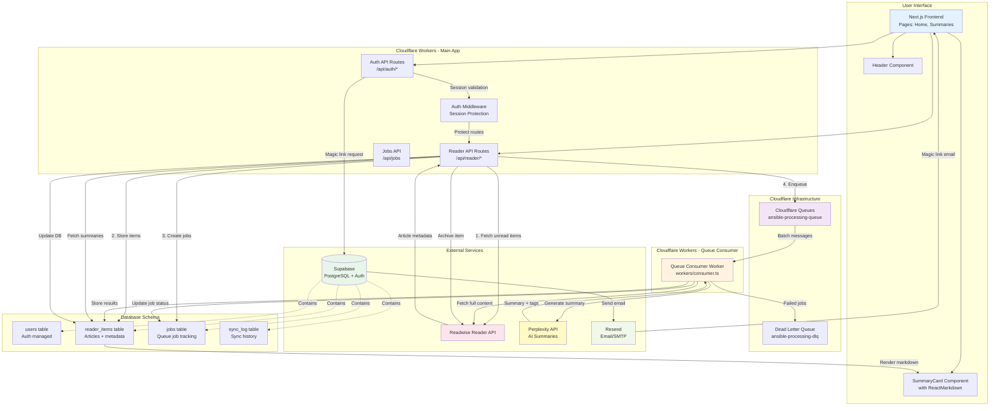

# Ansible AI Reader

AI-powered depth-of-engagement triage for Readwise Reader content. Generate summaries of unread items to decide what deserves full reading versus consuming just the key takeaways.

## About the Name

**Ansible** combines two concepts:
- Ursula K. Le Guin's **ansible** - an instant communication device from her Hainish Cycle novels
- The **Book of Thoth** - legendary repository of universal knowledge

Together: instant access to distilled knowledge from your reading list.

## Tech Stack

- **Framework**: Next.js 15 (App Router), React 19
- **Runtime**: Cloudflare Workers (Edge)
- **Database**: Supabase (PostgreSQL + Auth)
- **Queues**: Cloudflare Queues (async job processing)
- **UI**: ReactMarkdown for formatted summaries
- **AI**: Perplexity API (sonar-pro model)
- **Integrations**: Readwise Reader API, Resend (magic link emails)
- **Testing**: Vitest, React Testing Library (360 tests, 95%+ coverage)
- **CI/CD**: GitHub Actions

## Overview

Full specification: [`SPECIFICATIONS/ORIGINAL_IDEA/ansible-outline.md`](./SPECIFICATIONS/ORIGINAL_IDEA/ansible-outline.md)

### System Architecture



**Key Features:**
- **Magic Link Authentication**: Passwordless login via email
- **Async Queue Processing**: Cloudflare Queues for scalable AI summary generation
- **Markdown Rendering**: Beautiful formatting with bullets, bold, and links
- **Real-time Sync**: Fetch unread items from Readwise Reader
- **Tag Regeneration**: Bulk reprocess items missing AI-generated tags
- **Archive Sync**: Two-way sync with Readwise Reader

See [`REFERENCE/architecture/overview.md`](./REFERENCE/architecture/overview.md) for detailed documentation.

## Development

### Quick Start

```bash
# Install dependencies
npm install

# Set up environment variables
cp .env.example .env.local
# Edit .env.local with your API keys (see REFERENCE/operations/environment-setup.md)

# Run tests
npm test

# Start development server
npm run dev

# Build for production
npm run build:worker

# Deploy to Cloudflare
npm run deploy
```

### Documentation

- **[CLAUDE.md](./CLAUDE.md)** - Project navigation and development workflow
- **[REFERENCE/architecture/overview.md](./REFERENCE/architecture/overview.md)** - System architecture and data flows
- **[REFERENCE/development/testing-strategy.md](./REFERENCE/development/testing-strategy.md)** - Testing approach and coverage
- **[REFERENCE/operations/deployment.md](./REFERENCE/operations/deployment.md)** - CI/CD and production deployment
- **[REFERENCE/operations/troubleshooting.md](./REFERENCE/operations/troubleshooting.md)** - Common issues and solutions

### Built With

This project was built with [Claude Code](https://claude.com/claude-code) using:
- Test-driven development (TDD) workflow
- Agent teams for collaborative PR reviews
- 360 tests with 95%+ coverage
- Full traceability from specs to implementation
