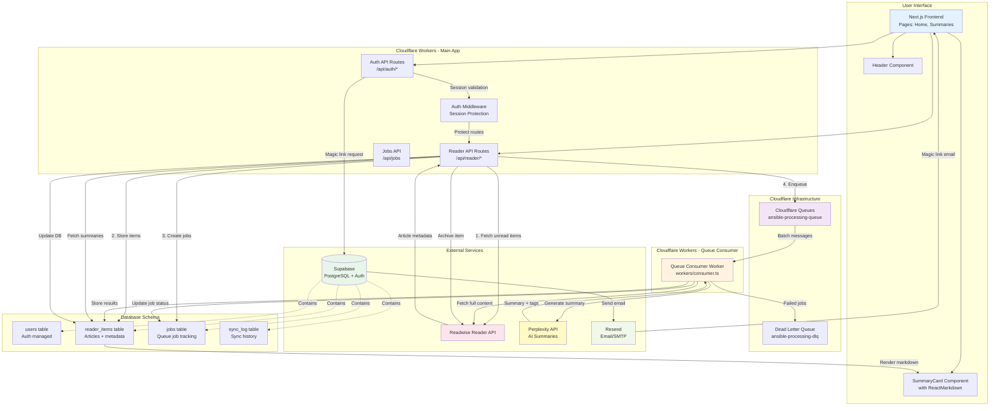

# Ansible AI Reader - System Architecture

**When to read this:** Understanding how the system works, onboarding new developers, or planning architectural changes.

**Related Documents:**
- [CLAUDE.md](../CLAUDE.md) - Project navigation index
- [deployment-guide.md](./deployment-guide.md) - Deployment and CI/CD
- [testing-strategy.md](./testing-strategy.md) - Testing approach

---



## Key Components

### 1. Frontend (Next.js 14+ App Router)
- **Home Page**: Magic link login form
- **Summaries Page**: Main interface for viewing/managing summaries
- **SummaryCard**: Renders markdown-formatted summaries with react-markdown
- **Header**: Navigation, sync button, regenerate tags, logout

### 2. Backend API Routes
- **Auth Routes** (`/api/auth/*`):
  - `/login`: Send magic link
  - `/callback`: Handle magic link verification
  - `/logout`: Sign out user

- **Reader Routes** (`/api/reader/*`):
  - `/sync`: Fetch items from Reader, create queue jobs
  - `/items`: Get user's summaries from DB
  - `/archive`: Archive item in Reader + local DB
  - `/status`: Poll sync progress
  - `/retry`: Re-enqueue failed jobs
  - `/regenerate-tags`: Queue tag regeneration for items

- **Jobs Route** (`/api/jobs`): Manual job creation (testing)

### 3. Workers
- **Main Worker**: Next.js app on Cloudflare Workers (wrangler.toml)
- **Consumer Worker**: Queue processor (wrangler-consumer.toml)
  - Batches: 10 messages, 30s timeout
  - Retries: 3 attempts before DLQ
  - Fetches full article content from Reader
  - Generates summaries via Perplexity
  - Stores results in Supabase

### 4. Data Flow

#### Sync Flow:
```
User clicks Sync
  → POST /api/reader/sync
  → Fetch from Reader API (paginated)
  → Store items in reader_items table
  → Create jobs in jobs table
  → Enqueue messages to Cloudflare Queue
  → Return sync_id for polling

Consumer Worker (async):
  → Receive batch from queue
  → Fetch full content from Reader API
  → Call Perplexity API for summary+tags
  → Store in reader_items table
  → Update jobs table status
```

#### View Flow:
```
User visits /summaries
  → GET /api/reader/items
  → Fetch items WHERE user_id AND archived_at IS NULL
  → Render SummaryCard with ReactMarkdown
  → Display bullets, bold, links formatted
```

#### Archive Flow:
```
User clicks Archive
  → POST /api/reader/archive
  → Archive in Reader API
  → Update reader_items (archived=true, archived_at=NOW)
  → Remove from UI
```

### 5. Database Schema

**users** (Supabase Auth managed)
- Standard Supabase auth fields

**reader_items**
- `id`: UUID (PK)
- `user_id`: UUID (FK to users)
- `reader_id`: String (Readwise item ID)
- `url`, `title`, `author`, `word_count`
- `summary`: Text (Perplexity generated)
- `tags`: Text[] (AI generated)
- `content_truncated`: Boolean
- `archived`, `archived_at`
- RLS: Users can only access their own items

**jobs**
- `id`: UUID (PK)
- `user_id`: UUID (FK)
- `reader_item_id`: UUID (FK to reader_items)
- `sync_log_id`: UUID (FK to sync_log)
- `status`: pending | processing | completed | failed
- `attempts`, `error_message`
- RLS: Users can only access their own jobs

**sync_log**
- `id`: UUID (PK)
- `user_id`: UUID (FK)
- `status`: in_progress | completed | failed
- `items_fetched`, `jobs_created`, `jobs_completed`, `jobs_failed`
- `total_tokens_used`
- RLS: Users can only access their own logs

### 6. External Service Integration

**Supabase**
- Authentication: Magic links via Resend SMTP
- Database: PostgreSQL with Row-Level Security
- Client patterns: Browser, Server, Middleware

**Readwise Reader**
- API endpoint: https://readwise.io/api/v3/
- Operations: List items, fetch full content, archive
- Rate limiting: Retry-After headers, exponential backoff

**Perplexity**
- Model: sonar-pro
- Input: Article content (max 30k chars)
- Output: 100-2000 char summary + 3-10 tags
- Token tracking for cost monitoring

**Resend**
- SMTP provider for Supabase Auth
- Sends magic link emails
- Domain: ansible.hultberg.org

### 7. Deployment

**Cloudflare Workers** (NOT Pages)
- Domain: ansible.hultberg.org
- Build: `@cloudflare/next-on-pages` adapter
- CI/CD: GitHub Actions on push to main
- Secrets: Managed via `wrangler secret put`
- Observability: Enabled for real-time logs

**Environment Variables**
- Build-time: `NEXT_PUBLIC_SUPABASE_*` (baked into bundle)
- Runtime: `SITE_URL`, API keys (read from env)
- Secrets: Never committed to git

## Request Flow Examples

### Magic Link Login
```
1. User enters email → POST /api/auth/login
2. Server calls Supabase auth.signInWithOtp()
3. Supabase generates token → Sends to Resend
4. Resend emails magic link to user
5. User clicks link → GET /api/auth/callback?code=...
6. Server exchanges code for session
7. Redirect to /summaries with cookie
```

### First Sync
```
1. User clicks Sync → POST /api/reader/sync
2. Create sync_log record (in_progress)
3. Loop: Fetch from Reader API (20 items/page)
4. For each item: Insert reader_items, create job
5. Batch enqueue to Cloudflare Queue
6. Return sync_id → Frontend polls /api/reader/status

Background (Consumer Worker):
7. Receive batch (10 jobs)
8. For each job:
   - Fetch full content from Reader
   - Call Perplexity API
   - Parse markdown response
   - Update reader_items with summary+tags
   - Update job status = completed
9. Update sync_log with totals
```

### Viewing Summaries
```
1. GET /summaries → SSR auth check
2. Client JS → GET /api/reader/items
3. Query: SELECT * FROM reader_items
   WHERE user_id = $1 AND archived_at IS NULL
4. Return JSON array
5. Render SummaryCard components
6. ReactMarkdown parses summary
7. Display formatted bullets, bold, links
```

## Technology Stack

- **Framework**: Next.js 15 (App Router)
- **Runtime**: Cloudflare Workers (Edge)
- **Database**: Supabase (PostgreSQL)
- **Auth**: Supabase Auth + Resend
- **Queues**: Cloudflare Queues
- **AI**: Perplexity API (sonar-pro)
- **UI**: React 19, ReactMarkdown
- **Testing**: Vitest, React Testing Library
- **CI/CD**: GitHub Actions
- **Domain**: ansible.hultberg.org (Cloudflare DNS)
