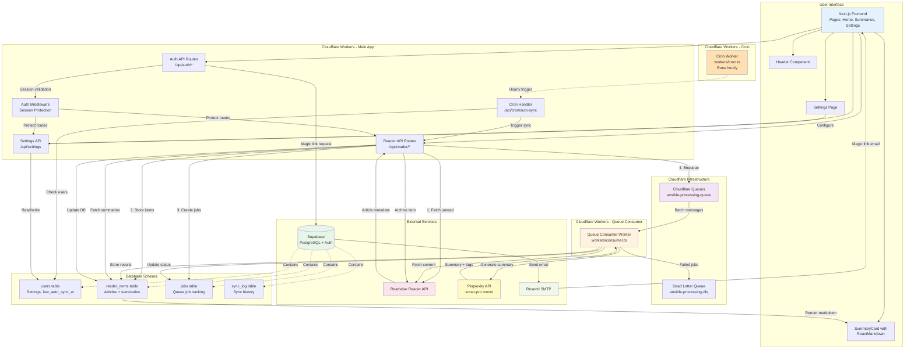

# System Overview
REFERENCE > Architecture > Overview

High-level system architecture, technology stack, and design decisions.

## What Is This?
Ansible AI Reader is an AI-powered depth-of-engagement triage system for Readwise Reader content. It generates AI summaries so you can decide what deserves full reading versus consuming just the key takeaways.

## Core Workflow
1. **Sync** unread items from Readwise Reader
2. **Generate** AI summaries via Perplexity API
3. **Review** summaries, add notes, rate interest
4. **Archive** items (syncs back to Reader) or read in full

## Technology Stack

### Frontend
- **Next.js 15** (App Router) - React framework
- **React 19** - UI library
- **ReactMarkdown** - Formatted summary rendering

### Backend
- **Cloudflare Workers** - Serverless runtime (NOT Pages)
- **Node.js runtime** - nodejs_compat compatibility mode

### Data & Storage
- **Supabase** - PostgreSQL database + Authentication
- **Cloudflare Queues** - Async job processing

### External Services
- **Readwise Reader API** - Article sync and content fetching
- **Perplexity API** (sonar-pro) - AI summary generation
- **Resend** - Email delivery for magic links

### Development
- **TypeScript** - Type safety
- **Vitest** - Testing framework (~293 tests)
- **GitHub Actions** - CI/CD pipeline

## 3-Worker Architecture

We deploy **three separate Cloudflare Workers**:

### 1. Main App Worker (`wrangler.toml`)
- Next.js application
- API routes for auth, sync, settings
- Queue producer
- Serves UI

### 2. Queue Consumer Worker (`wrangler-consumer.toml`)
- Processes async jobs from Cloudflare Queues
- Fetches full article content from Reader
- Generates summaries via Perplexity
- Updates database with results

### 3. Cron Worker (`wrangler-cron.toml`)
- Runs hourly (cron schedule)
- Triggers automated sync for users with sync_interval > 0
- Separate worker because OpenNext doesn't support scheduled() function

**Why 3 workers?** OpenNext (Cloudflare adapter for Next.js) only generates HTTP request handlers, not scheduled event handlers. The cron functionality must be in a separate worker.

## System Diagram

## Key Design Decisions

### Why Cloudflare Workers (not Pages)?
- Need queue producer bindings (not available in Pages)
- Better control over worker configuration
- Can deploy multiple workers (main + consumer + cron)

### Why Async Queue Processing?
- AI summary generation is slow (2-5 seconds per article)
- User doesn't wait for summaries during sync
- Batching optimizes API calls and reduces costs
- Automatic retries for failed jobs

### Why Service Role Client for Settings?
- Cookie-based SSR auth doesn't pass JWT to Postgres
- RLS policies check `auth.uid()` which returns null
- Service role bypasses RLS (safe when auth verified at API level)
- See [patterns/service-role-client.md](../patterns/service-role-client.md)

### Why 3 Separate Workers?
- OpenNext limitation: Only generates HTTP handlers
- Cron needs scheduled() function
- Queue consumer is long-running (30s timeout)
- Separation of concerns: API, processing, scheduling

## Deployment
- **Domain**: ansible.hultberg.org
- **CI/CD**: GitHub Actions auto-deploys on push to main
- **Secrets**: Managed via `wrangler secret put`
- **Observability**: Enabled on all 3 workers

## Related Documentation
- [Workers](./workers.md) - Detailed worker implementation
- [Database Schema](./database-schema.md) - Tables and relationships
- [Authentication](./authentication.md) - Auth flow and security
- [API Design](./api-design.md) - REST conventions
- [Deployment Guide](../operations/deployment.md) - How to deploy
