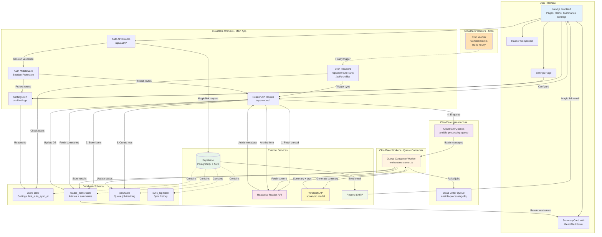
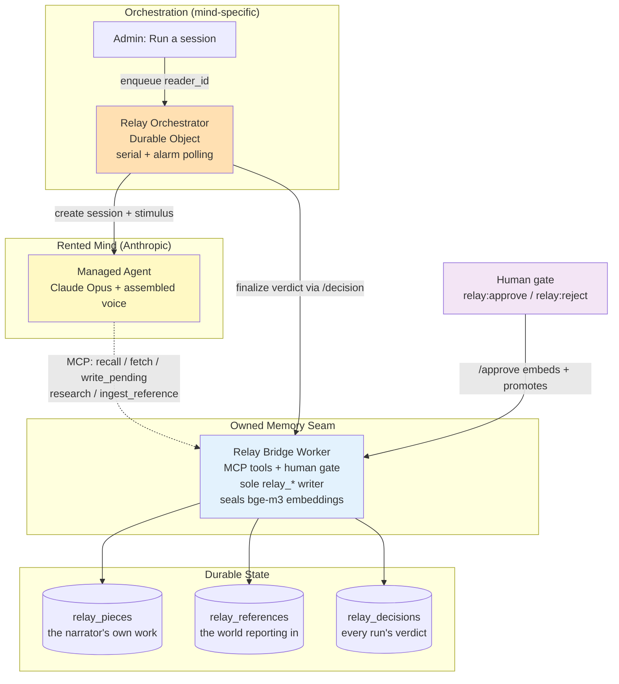

# System Overview
REFERENCE > Architecture > Overview

High-level system architecture, technology stack, and design decisions.

## What Is This?
Ansible AI Reader is an AI-powered depth-of-engagement triage system for Readwise Reader content. It generates AI summaries so you can decide what deserves full reading versus consuming just the key takeaways.

## Core Workflow
1. **Sync** unread items from Readwise Reader
2. **Generate** AI summaries via Perplexity API
3. **Review** summaries, add notes, rate interest
4. **Archive** items (syncs back to Reader) or read in full

## Technology Stack

### Frontend
- **Next.js 15** (App Router) - React framework
- **React 19** - UI library
- **ReactMarkdown** - Formatted summary rendering

### Backend
- **Cloudflare Workers** - Serverless runtime (NOT Pages)
- **Node.js runtime** - nodejs_compat compatibility mode

### Data & Storage
- **Supabase** - PostgreSQL database + Authentication
- **Cloudflare Queues** - Async job processing

### External Services
- **Readwise Reader API** - Article sync and content fetching
- **Perplexity API** (sonar-pro) - AI summary generation
- **Resend** - Email delivery for magic links
- **Anthropic Managed Agents** (Claude Opus) - The "mind" of the Relay narrator subsystem (a rented agent harness)
- **Workers AI** (bge-m3) - 1024-dim embeddings for Relay recall, sealed inside the Relay bridge

### Development
- **TypeScript** - Type safety
- **Vitest** - Testing framework (run `npm test` for the live count; 95%+ coverage target)
- **GitHub Actions** - CI/CD pipeline

## Worker Architecture

We deploy **five Cloudflare Workers**: three for the core Ansible app, plus two for the **Relay** subsystem (an autonomous-narrator experiment layered on Ansible). The two groups are split for *different reasons* — the core split is forced by an OpenNext limitation; the Relay split is deliberate architecture (see below).

### 1. Main App Worker (`wrangler.toml`)
- Next.js application
- API routes for auth, sync, settings
- Queue producer
- Serves UI

### 2. Queue Consumer Worker (`wrangler-consumer.toml`)
- Processes async jobs from Cloudflare Queues
- Fetches full article content from Reader
- Generates summaries via Perplexity
- Updates database with results

### 3. Cron Worker (`wrangler-cron.toml`)
- Runs hourly (cron schedule)
- Triggers automated sync for users with sync_interval > 0, and the Fika email for users whose local send hour has arrived (two independent, concurrent calls)
- Separate worker because OpenNext doesn't support scheduled() function

**Why these 3 split out?** OpenNext (Cloudflare adapter for Next.js) only generates HTTP request handlers, not scheduled event handlers. The cron functionality must be in a separate worker, and queue consumption is isolated for the same handler-shape reason.

### 4. Relay Bridge Worker (`wrangler-relay-bridge.toml`)
- The **owned-memory gateway** for Relay, and the **only** thing that touches the `relay_*` tables (service-role; bypasses RLS)
- Exposes a back-fill route, a human-gate control plane (`/decision`, `/approve`, `/reject`), and a small **MCP tool surface** (`recall` / `fetch` / `write_pending` / `ingest_reference` / `research`) — the agent's only route in
- Also seals the embedding model (Workers AI `bge-m3`) inside itself, so recall and approval embed through one path and vectors never drift
- Separate from the main app for a **different reason than the cron/consumer split**: it is the deliberate "swappable seam" (see below)

### 5. Relay Orchestrator Worker (`wrangler-relay-orchestrator.toml`)
- A single-threaded **Durable Object** (`RelayOrchestrator`) that holds the "mind": it runs one Managed-Agent session at a time and finalizes the verdict *through* the bridge
- Alarm-driven polling — it waits out a ~5-minute agent session across durable alarms rather than holding a Worker invocation (which Cloudflare hard-cancels at ~4 min)
- **Superseded** the earlier queue-consumer approach (`wrangler-relay-session.toml`, now retired) for exactly that wall-clock reason — see ADR [2026-07-07-relay-orchestrator-durable-object.md](../decisions/2026-07-07-relay-orchestrator-durable-object.md)
- It is the *only* worker holding the Anthropic API credential, so the user-facing app never touches the agent brain — it's a pure queue producer that just enqueues a `reader_id`

### The Managed Agents Connection (Relay)

Relay's guiding principle is **"mind rented, memory owned"**:

- The **mind** is an Anthropic-hosted **Managed Agent** (Claude Opus) — a rented harness the orchestrator drives via the Managed Agents API. It reaches back into Ansible only through the bridge's MCP tools.
- The **memory** is the `relay_*` tables, owned by us and living behind the bridge. It outlives any particular agent harness.
- The **bridge is the swappable seam**: because *all* durable Relay state flows through it, the mind can be swapped later (Managed Agents → Cloudflare Agents SDK) by rewriting only the thin orchestrator, leaving the memory untouched.

For the full mechanics — how the agent is provisioned, how the voice is assembled, the MCP handshake, and the human-gate flow — see **[use-of-managed-agents.md](./use-of-managed-agents.md)**. For the subsystem spec, see `SPECIFICATIONS/relay/stage-1-technical-spec.md`.

## System Diagram

```mermaid
graph TB
    subgraph "User Interface"
        UI[Next.js Frontend<br/>Pages: Home, Summaries, Settings]
        Header[Header Component]
        SummaryCard[SummaryCard with<br/>ReactMarkdown]
        SettingsPage[Settings Page]
    end

    subgraph "Cloudflare Workers - Main App"
        Auth[Auth API Routes<br/>/api/auth/*]
        ReaderAPI[Reader API Routes<br/>/api/reader/*]
        SettingsAPI[Settings API<br/>/api/settings]
        CronAPI[Cron Handlers<br/>/api/cron/auto-sync<br/>/api/cron/fika]
        Middleware[Auth Middleware<br/>Session Protection]
    end

    subgraph "Cloudflare Workers - Queue Consumer"
        Consumer[Queue Consumer Worker<br/>workers/consumer.ts]
    end

    subgraph "Cloudflare Workers - Cron"
        CronWorker[Cron Worker<br/>workers/cron.ts<br/>Runs hourly]
    end

    subgraph "Cloudflare Infrastructure"
        Queue[Cloudflare Queues<br/>ansible-processing-queue]
        DLQ[Dead Letter Queue<br/>ansible-processing-dlq]
    end

    subgraph "External Services"
        Supabase[(Supabase<br/>PostgreSQL + Auth)]
        Reader[Readwise Reader API]
        Perplexity[Perplexity API<br/>sonar-pro model]
        Resend[Resend SMTP]
    end

    subgraph "Database Schema"
        DB_Users[users table<br/>Settings, last_auto_sync_at]
        DB_Items[reader_items table<br/>Articles + summaries]
        DB_Jobs[jobs table<br/>Queue job tracking]
        DB_Sync[sync_log table<br/>Sync history]
    end

    %% User flows
    UI --> Header
    UI --> SummaryCard
    UI --> SettingsPage
    UI --> Auth
    UI --> ReaderAPI
    UI --> SettingsAPI

    %% Cron flow
    CronWorker -.->|Hourly trigger| CronAPI
    CronAPI -->|Check users| DB_Users
    CronAPI -->|Trigger sync| ReaderAPI

    %% Auth flow
    Auth -->|Magic link request| Supabase
    Supabase -->|Send email| Resend
    Resend -->|Magic link email| UI
    Auth -->|Session validation| Middleware
    Middleware -->|Protect routes| ReaderAPI
    Middleware -->|Protect routes| SettingsAPI

    %% Settings flow
    SettingsAPI -->|Read/write| DB_Users
    SettingsPage -->|Configure| SettingsAPI

    %% Sync flow
    ReaderAPI -->|1. Fetch unread| Reader
    Reader -->|Article metadata| ReaderAPI
    ReaderAPI -->|2. Store items| DB_Items
    ReaderAPI -->|3. Create jobs| DB_Jobs
    ReaderAPI -->|4. Enqueue| Queue

    %% Queue processing
    Queue -->|Batch messages| Consumer
    Consumer -->|Fetch content| Reader
    Consumer -->|Generate summary| Perplexity
    Perplexity -->|Summary + tags| Consumer
    Consumer -->|Store results| DB_Items
    Consumer -->|Update status| DB_Jobs
    Consumer -->|Failed jobs| DLQ

    %% Display flow
    ReaderAPI -->|Fetch summaries| DB_Items
    DB_Items -->|Render markdown| SummaryCard

    %% Archive flow
    ReaderAPI -->|Archive item| Reader
    ReaderAPI -->|Update DB| DB_Items

    %% Database relationships
    Supabase -.->|Contains| DB_Users
    Supabase -.->|Contains| DB_Items
    Supabase -.->|Contains| DB_Jobs
    Supabase -.->|Contains| DB_Sync

    style UI fill:#e3f2fd
    style Consumer fill:#fff3e0
    style CronWorker fill:#ffe0b2
    style Queue fill:#f3e5f5
    style Supabase fill:#e8f5e9
    style Reader fill:#fce4ec
    style Perplexity fill:#fff9c4
    style Resend fill:#f1f8e9
```

## Relay Subsystem Diagram

The main diagram above is the core Ansible app. Relay layers on top of it — kept separate here because it has its own trust boundary (mind rented, memory owned):

```mermaid
graph TB
    subgraph "Rented Mind (Anthropic)"
        MA[Managed Agent<br/>Claude Opus + assembled voice]
    end

    subgraph "Orchestration (mind-specific)"
        Admin[Admin: Run a session]
        Orchestrator[Relay Orchestrator<br/>Durable Object<br/>serial + alarm polling]
    end

    subgraph "Owned Memory Seam"
        Bridge[Relay Bridge Worker<br/>MCP tools + human gate<br/>sole relay_* writer<br/>seals bge-m3 embeddings]
    end

    subgraph "Durable State"
        RelayPieces[(relay_pieces<br/>the narrator's own work)]
        RelayRefs[(relay_references<br/>the world reporting in)]
        RelayDecisions[(relay_decisions<br/>every run's verdict)]
    end

    Human[Human gate<br/>relay:approve / relay:reject]

    Admin -->|enqueue reader_id| Orchestrator
    Orchestrator -->|create session + stimulus| MA
    MA -.->|MCP: recall / fetch / write_pending<br/>research / ingest_reference| Bridge
    Orchestrator -->|finalize verdict via /decision| Bridge
    Bridge --> RelayPieces
    Bridge --> RelayRefs
    Bridge --> RelayDecisions
    Human -->|/approve embeds + promotes| Bridge

    style MA fill:#fff9c4
    style Orchestrator fill:#ffe0b2
    style Bridge fill:#e3f2fd
    style Human fill:#f3e5f5
```

**Reading the boundary:** the agent (top) can only touch memory (bottom) through the bridge's MCP tools, and it is deliberately **blind to the human gate** — no tool tells it whether a piece was approved, rejected, or deployed. The orchestrator, not the agent, holds the Anthropic credential and finalizes each verdict through a *separate* control-plane token.

## Key Design Decisions

### Why Cloudflare Workers (not Pages)?
- Need queue producer bindings (not available in Pages)
- Better control over worker configuration
- Can deploy multiple workers (main + consumer + cron)

### Why Async Queue Processing?
- AI summary generation is slow (2-5 seconds per article)
- User doesn't wait for summaries during sync
- Batching optimizes API calls and reduces costs
- Automatic retries for failed jobs

### Why Service Role Client for Settings?
- Cookie-based SSR auth doesn't pass JWT to Postgres
- RLS policies check `auth.uid()` which returns null
- Service role bypasses RLS (safe when auth verified at API level)
- See [patterns/service-role-client.md](../patterns/service-role-client.md)

### Why Separate Workers?
- OpenNext limitation: Only generates HTTP handlers
- Cron needs scheduled() function
- Queue consumer is long-running (30s timeout)
- Separation of concerns: API, processing, scheduling
- **Relay bridge & orchestrator**: a deliberate split (architectural intent, not an OpenNext limitation) — the bridge is the "swappable seam" owning the `relay_*` tables, and the orchestrator is a Durable Object because a rented agent session outlives a single Worker invocation. See [use-of-managed-agents.md](./use-of-managed-agents.md)

## Deployment
- **Domain**: ansible.hultberg.org
- **CI/CD**: GitHub Actions auto-deploys on push to main
- **Secrets**: Managed via `wrangler secret put`
- **Observability**: Enabled on all 5 workers
- **CI scope**: GitHub Actions auto-deploys **all workers** on every push to main, in one pipeline (consumer → cron → relay orchestrator → main app → relay bridge; the orchestrator precedes the app because of the DO binding, and the bridge is last so an experimental-worker failure can't gate the app)

## Related Documentation
- [Workers](./workers.md) - Detailed worker implementation
- [Use of Managed Agents](./use-of-managed-agents.md) - How the Relay narrator's rented "mind" connects to owned memory
- [Database Schema](./database-schema.md) - Tables and relationships
- [Authentication](./authentication.md) - Auth flow and security
- [API Design](./api-design.md) - REST conventions
- [Deployment Guide](../operations/deployment.md) - How to deploy
